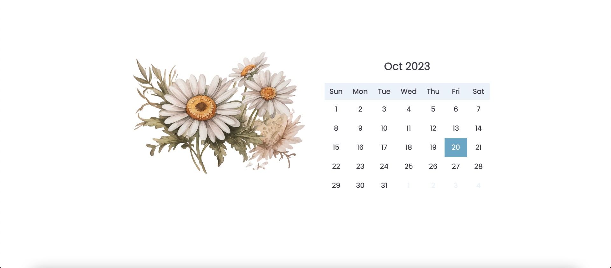

# FlowerJournal

This repository is a journal application with a beautiful user interface (UI) inspired by the enchanting beauty of flowers. It provides a delightful experience for users to document their thoughts, experiences, and memories. 

## Project Setup

```sh
npm install
```

### Compile and Hot-Reload for Development

```sh
npm run dev
```

### Compile and Minify for Production

```sh
npm run build
```
## Screenshot
